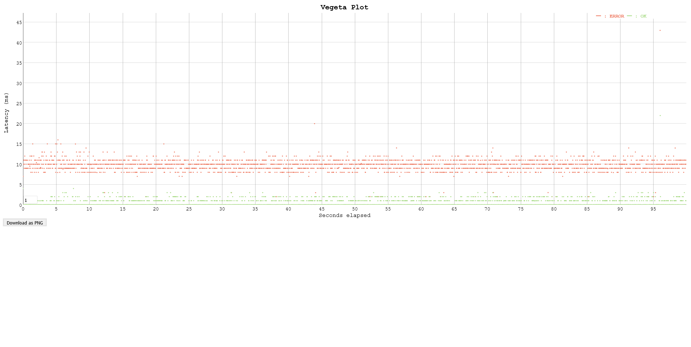
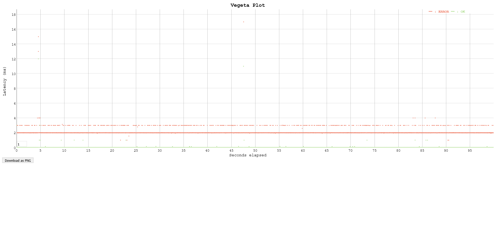

### Replication of gin gonic's [issue #1929](https://github.com/gin-gonic/gin/issues/1929)

See the issue for context.

Maybe the problem is in the recover middleware. https://github.com/gin-gonic/gin/issues/1929#issuecomment-643763836

To reproduce the problem i wrote a code that panics and i used [vegeta](https://github.com/tsenart/vegeta) to attack the service. It can be used with router configuration, see the [main.go](main.go).

### 1. Test in laptop on vs code terminal

* OS: Windows 10 Versión 10.0.18363 build 18363
* Processor: Intel(R) Core(TM) i5-3337U CPU @ 1.80GHz, 1801 Mhz
* RAM: 16 GB DDR3 1600 MHZ
* SSD: 550MB/s read and write

#### 1.1 Default router

```go
router = gin.Default()
```

This tests uses gin.Default() router, open the terminal in [vs code](https://code.visualstudio.com/) an run it.

```sh
go run .
```

In other terminal attack it with vegeta. This takes 100 seconds to finish.

```sh
vegeta attack -duration=100s -targets=targets.http | tee results.bin | vegeta report
```

The results.

```sh
Requests      [total, rate, throughput]         5000, 50.01, 0.05
Duration      [total, attack, wait]             2m10s, 1m40s, 30.001s
Latencies     [min, mean, 50, 90, 95, 99, max]  6.997ms, 29.967s, 30.001s, 30.001s, 30.004s, 30.024s, 30.147s
Bytes In      [total, mean]                     72, 0.01
Bytes Out     [total, mean]                     0, 0.00
Success       [ratio]                           0.12%
Status Codes  [code:count]                      0:4992  200:6  500:2
Error Set:
500 Internal Server Error
Get "http://127.0.0.1:8080/panic": context deadline exceeded (Client.Timeout exceeded while awaiting headers)
Get "http://127.0.0.1:8080/ok": context deadline exceeded (Client.Timeout exceeded while awaiting headers)
Get "http://127.0.0.1:8080/ok": context deadline exceeded
Get "http://127.0.0.1:8080/panic": context deadline exceeded
```


#### 1.2 Default router with no logs

```go
gin.DefaultWriter = ioutil.Discard
gin.DefaultErrorWriter = ioutil.Discard
router = gin.Default()
```

Uses gin.Default and disable the log writers, start the router with gin's recover middleware.

```sh
env GINROUTER=nolog go run .
```

Atack it in other terminal

```sh
vegeta attack -duration=100s -targets=targets.http | tee results.bin | vegeta report
```

The results.

```sh
Requests      [total, rate, throughput]         5000, 50.01, 25.00
Duration      [total, attack, wait]             1m40s, 1m40s, 1.993ms
Latencies     [min, mean, 50, 90, 95, 99, max]  1.993ms, 1.069ms, 1.016ms, 1.999ms, 2.992ms, 2.996ms, 10.993ms
Bytes In      [total, mean]                     30000, 6.00
Bytes Out     [total, mean]                     0, 0.00
Success       [ratio]                           50.00%
Status Codes  [code:count]                      200:2500  500:2500
Error Set:
500 Internal Server Error
```


It is curious to see how the results have improved. Maybe there's a bottleneck when writes to sdtout/stderr.

https://developpaper.com/why-is-it-slow-to-print-logs-to-the-console/

https://github.com/microsoft/vscode/issues/81047

I'll try with other terminal later.

#### 1.3 go-api recover middleware

```go
router = gin.New()
router.Use(Recover())
```

gin.New router with [go-api](https://github.com/daheige/go-api) recover middleware. Thanks to [daheige](https://github.com/daheige).

```sh
env GINROUTER=go-api go run .
```

Atack it in other terminal

```sh
vegeta attack -duration=100s -targets=targets.http | tee results.bin | vegeta report
```

The results.

```sh
Requests      [total, rate, throughput]         5000, 50.01, 25.01
Duration      [total, attack, wait]             1m40s, 1m40s, 0s
Latencies     [min, mean, 50, 90, 95, 99, max]  0s, 13.444µs, 0s, 0s, 0s, 5.446µs, 11.993ms
Bytes In      [total, mean]                     122500, 24.50
Bytes Out     [total, mean]                     0, 0.00
Success       [ratio]                           50.00%
Status Codes  [code:count]                      200:2500  500:2500
Error Set:
500 Internal Server Error
```


This looks like the faster way.

### 2. Test in laptop on cmd

* OS: Windows 10 Versión 10.0.18363 build 18363
* Processor: Intel(R) Core(TM) i5-3337U CPU @ 1.80GHz, 1801 Mhz
* RAM: 16 GB DDR3 1600 MHZ
* SSD: 550MB/s read and write

#### 2.1 Default router

Open a cmd terminal, and run it.

```sh
go run .
```

Atack it in other terminal

```sh
vegeta attack -duration=100s -targets=targets.http | tee results.bin | vegeta report
```

The results.

```sh
Requests      [total, rate, throughput]         5000, 50.01, 25.00
Duration      [total, attack, wait]             1m40s, 1m40s, 10.985ms
Latencies     [min, mean, 50, 90, 95, 99, max]  992µs, 5.103ms, 3.516ms, 10.987ms, 10.994ms, 12.128ms, 42.974ms
Bytes In      [total, mean]                     30000, 6.00
Bytes Out     [total, mean]                     0, 0.00
Success       [ratio]                           50.00%
Status Codes  [code:count]                      200:2500  500:2500
Error Set:
500 Internal Server Error
```



Compared with vs code terminal, using cmd is faster.

#### 2.2 Default router with no logs

Run it.

```sh
SET GINROUTER=nolog
go run .
```

Atack it in other terminal

```sh
vegeta attack -duration=100s -targets=targets.http | tee results.bin | vegeta report
```

The results.

```sh
Requests      [total, rate, throughput]         5000, 50.01, 25.00
Duration      [total, attack, wait]             1m40s, 1m40s, 1.995ms
Latencies     [min, mean, 50, 90, 95, 99, max]  1.995ms, 1.092ms, 1.158ms, 2ms, 2.993ms, 2.998ms, 16.991ms
Bytes In      [total, mean]                     30000, 6.00
Bytes Out     [total, mean]                     0, 0.00
Success       [ratio]                           50.00%
Status Codes  [code:count]                      200:2500  500:2500
Error Set:
500 Internal Server Error
```



This is some faster that default router

#### 2.3 go-api recover middleware

Run it.

```sh
SET GINROUTER=go-api
go run .
```

Atack it in other terminal

```sh
vegeta attack -duration=100s -targets=targets.http | tee results.bin | vegeta report
```

The results.

```sh
Requests      [total, rate, throughput]         5000, 50.01, 25.00
Duration      [total, attack, wait]             1m40s, 1m40s, 0s
Latencies     [min, mean, 50, 90, 95, 99, max]  0s, 14.038µs, 0s, 0s, 0s, 97.465µs, 17.99ms
Bytes In      [total, mean]                     122500, 24.50
Bytes Out     [total, mean]                     0, 0.00
Success       [ratio]                           50.00%
Status Codes  [code:count]                      200:2500  500:2500
Error Set:
500 Internal Server Error
```


Again, is the faster way.
